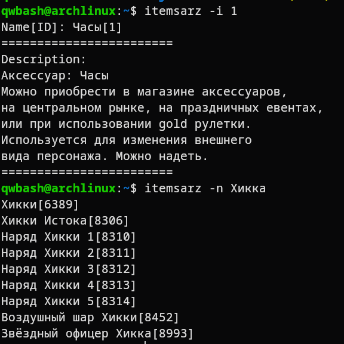

# arizona-items-info

A utility for retrieving information about Arizona Online game items using their ID or approximate name.

Dependencies:  
[json-c](https://github.com/json-c/json-c)

Install:
```
sudo make install clean
```

Usage:
```
#Show help screen
itemsarz -h

#Search by item_id
itemsarz -i 123

#Search by approximate item name
itemsarz -n Хикка
```

Preview:  
